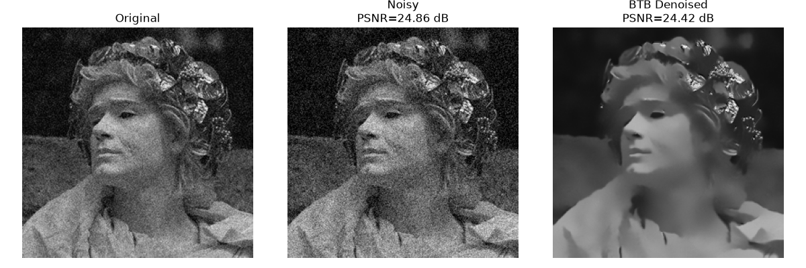
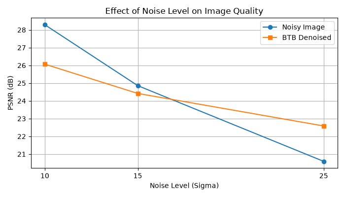
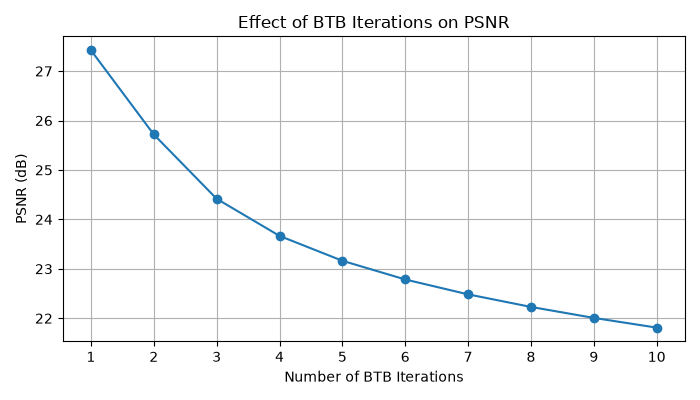

# BTB Image Denoising OEL

**Method-level reproduction of the Back-to-Basics (BTB) iterative image denoising framework using Non-Local Means (NLM).**

**Author:** Tamjid Tahmid  
**Student ID:** 20230105012  
**Department:** Electrical and Electronic Engineering, Ahsanullah University of Science and Technology (AUST)  
**Course:** EEE 3218 - Digital Signal Processing Lab

---

## Project Overview

This project reproduces the central iterative idea of Deborah Pereg's 2024 paper, **"Back to basics: Fast denoising iterative algorithm."** A user selects an image, controlled additive white Gaussian noise (AWGN) is added, and the noisy image is processed through the BTB update using NLM as the base denoiser.

The core update is:

```text
z_(t+1) = f(x_t)
x_(t+1) = (1 - mu)x_t + mu z_(t+1)
```

where `f(.)` is the base denoiser, `mu` is the step size, and `t` is the iteration index.

> **Important:** The original paper's natural-image experiment uses pretrained TNRD. This repository uses NLM to keep the reproduction lightweight, transparent, and easy to demonstrate. Therefore, this is a **method-level reproduction**, not an exact numerical replication of the paper.

## Workflow

```text
Select Image
    |
    v
Grayscale + Resize + Normalize
    |
    v
Add AWGN
    |
    v
Noisy Image
    |
    v
NLM Base Denoiser
    |
    v
BTB Iterative Update
    |
    v
Denoised Image
    |
    v
MSE + PSNR + SSIM + Sensitivity Analysis
```

## Results

### Original, noisy and BTB output



For the showcased image at `sigma = 15`:

| Image | PSNR |
|---|---:|
| Noisy input | 24.86 dB |
| BTB + NLM output | 24.42 dB |

The BTB output is visually smoother, but its PSNR is slightly lower. This means that the selected NLM configuration removes visible grain while also changing fine details that are present in the reference image.

### Noise-level sensitivity



The experiment uses `sigma = 10, 15, 25`, matching the AWGN levels examined in the paper's natural-image section. In this reproduction, BTB + NLM is not beneficial at the lower tested noise levels but becomes useful at the stronger `sigma = 25` case. This demonstrates that the effectiveness of the BTB framework depends strongly on the base denoiser and its parameters.

### Iteration sensitivity



PSNR decreases as the number of repeated NLM-based BTB iterations increases for this test image. The main interpretation is **over-smoothing**: repeated denoising removes not only noise but also high-frequency image detail.

## Parameters

| Parameter | Value | Meaning |
|---|---:|---|
| Main AWGN sigma | 15 | Added noise standard deviation on the 0-255 scale |
| BTB iterations | 3 | Main demonstration iteration count |
| `mu` | 0.7 | BTB update weight |
| NLM `h` | `0.8 * sigma/255` | Denoising strength |
| Patch size | 5 | NLM patch size |
| Patch distance | 6 | NLM search distance |
| Image size | 256 x 256 | Consistent demonstration size |

## Evaluation Metrics

- **MSE:** mean squared pixel error. Lower is better.
- **PSNR:** logarithmic fidelity measure derived from MSE. Higher is generally better.
- **SSIM:** structural similarity between the processed and reference images. Higher is better.

## Installation

Python 3.10+ is recommended.

```bash
python -m venv .venv
```

Windows:

```bash
.venv\Scripts\activate
pip install -r requirements.txt
```

Run:

```bash
python btb_denoising.py
```

A file-picker window will appear. Select a JPG, JPEG, PNG, or BMP image.

## Repository Structure

```text
BTB-Image-Denoising-OEL/
|-- README.md
|-- btb_denoising.py
|-- requirements.txt
|-- LICENSE
|-- CITATION.cff
|-- GITHUB_SETUP.md
|-- SHOWCASE_GUIDE.md
|-- results/
|   |-- denoising_comparison.png
|   |-- noise_sensitivity.png
|   `-- iteration_sensitivity.png
|-- report/
|   |-- EEE3218_BTB_OEL_Report.pdf
|   `-- EEE3218_BTB_One_Page_Summary.pdf
|-- references/
|   `-- paper_reference.md
`-- docs/
    |-- index.html
    |-- style.css
    |-- assets/
    `-- downloads/
```

## Critical Evaluation

**Strengths**

- Very simple BTB update rule.
- Clear before/after visualization.
- Reproducible AWGN generation through a fixed random seed.
- Quantitative validation using MSE, PSNR and SSIM.
- Parameter sensitivity is explicitly demonstrated.

**Limitations**

- NLM replaces the pretrained TNRD used in the original paper.
- Fixed NLM parameters are not optimal for every image or noise level.
- Repeated NLM iterations can over-smooth fine details.
- PSNR is a reference-based metric and does not always match perceived visual quality.

## Original Paper

Deborah Pereg, **"Back to basics: Fast denoising iterative algorithm,"** *Signal Processing*, vol. 221, 109482, 2024.  
DOI: https://doi.org/10.1016/j.sigpro.2024.109482

See [`references/paper_reference.md`](references/paper_reference.md) for the reproduction note.

## Report and Project Website

- Full OEL report: [`report/EEE3218_BTB_OEL_Report.pdf`](report/EEE3218_BTB_OEL_Report.pdf)
- One-page summary: [`report/EEE3218_BTB_One_Page_Summary.pdf`](report/EEE3218_BTB_One_Page_Summary.pdf)
- GitHub Pages source: [`docs/`](docs/)
- Showcase script: [`SHOWCASE_GUIDE.md`](SHOWCASE_GUIDE.md)

## License

This repository is released under the **MIT License**. The original research paper remains the property of its publisher/authors and is cited rather than redistributed here.
